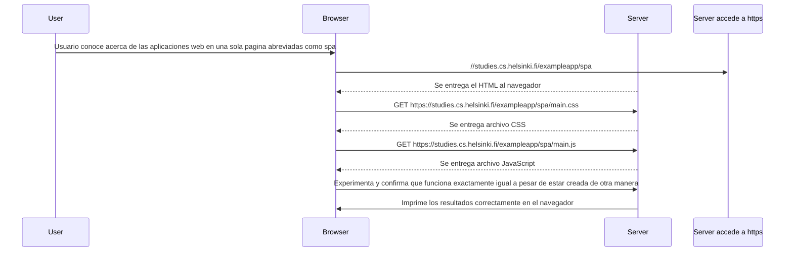

```mermaid
sequenceDiagram
    participant User
    participant Browser
    participant Server

    User->>Browser:Usuario conoce acerca de las aplicaciones web en una sola pagina abreviadas como spa
    Browser->>Server accede a https://studies.cs.helsinki.fi/exampleapp/spa
    Server-->>Browser: Se entrega el HTML al navegador

    Browser->>Server: GET https://studies.cs.helsinki.fi/exampleapp/spa/main.css
    Server-->>Browser: Se entrega archivo CSS

    Browser->>Server: GET https://studies.cs.helsinki.fi/exampleapp/spa/main.js
    Server-->>Browser: Se entrega archivo JavaScript

    Browser->>Server: Experimenta y confirma que funciona exactamente igual a pesar de estar creada de otra manera
    Server->>Browser: Imprime los resultados correctamente en el navegador
```
