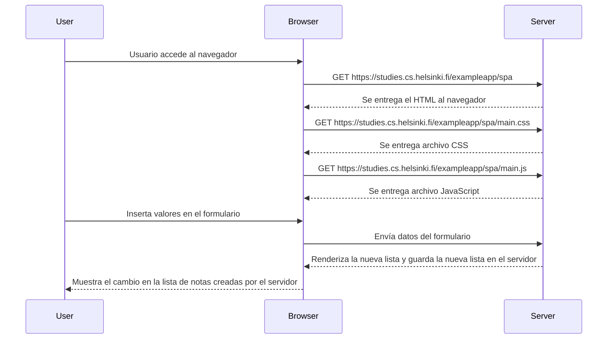

```mermaid
sequenceDiagram
    participant User
    participant Browser
    participant Server

    User->>Browser: Usuario accede al navegador
    Browser->>Server: GET https://studies.cs.helsinki.fi/exampleapp/spa
    Server-->>Browser: Se entrega el HTML al navegador

    Browser->>Server: GET https://studies.cs.helsinki.fi/exampleapp/spa/main.css
    Server-->>Browser: Se entrega archivo CSS

    Browser->>Server: GET https://studies.cs.helsinki.fi/exampleapp/spa/main.js
    Server-->>Browser: Se entrega archivo JavaScript

    User->>Browser: Inserta valores en el formulario
    Browser->>Server: Envía datos del formulario

    Server-->>Browser: Renderiza la nueva lista y guarda la nueva lista en el servidor
    Browser-->>User: Muestra el cambio en la lista de notas creadas por el servidor
```
